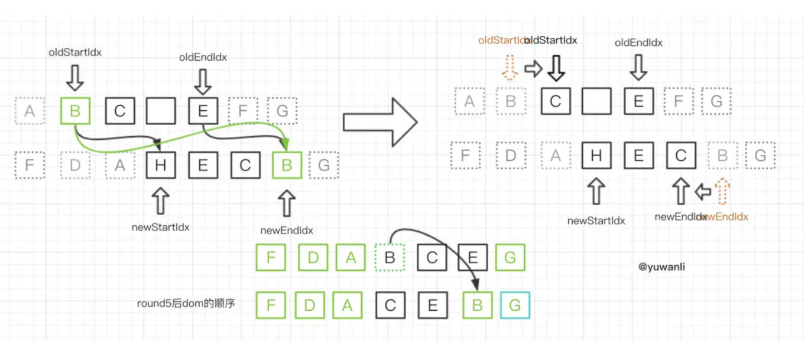

# diff算法

## vue的diff实现
2的diff其实是从组件开始的，而3的diff是从每个依赖收集的需要改动的节点开始diff的所以速度更快
``` js
const RootComponent = {
  template: `
  <div>test</div>
  <p :class="state.name">
    <span>Count is</span>
    <div v-for="value in state.fordata">
      {{value}}
    </div>
  </p>
  <button @click="increment" v-if="state.show">
    Count is: {{ state.count }}
  </button>
`,
  setup() {
    const state = reactive({
      name:'test',
      count: 2,
      show: true,
      fordata: [222, 333, 4444]
    })
    
    function increment() {
      state.name = 'test1';
      state.count++;
      state.fordata = [32, 222, 45, 67];
    }

    return {
      state,
      increment
    }
  }
}
createApp().mount(RootComponent, '#container')
```
打印出来可以看到最终生成的vnode，大概如下

component键里面保存的就是组件实例，该组件实例中subtree就是使用编译函数返回的函数运行出来的虚拟dom树
在该dom树中有type可以标记在该dom树中他所属于的类型，这里可以知道他是片段块类型(注意vnode中的type
存储的是传进来的模版对象)
根据以前的分析可知，当触发点击事件时候最终触发createRenderer.ts中的setupRenderEffect方法，我们
大概简化下该方法如下
``` js
// 组件更新时候触发下面这段逻辑代码

const { next } = instance

if (next !== null) {
  updateComponentPreRender(instance, next)
}
const prevTree = instance.subTree   // 保存先前组件dom树
// 实际上就是运行component.ts文件的finishComponentSetup方法中已经生成渲染函数（就是compile之后
// 生成的可执行函数，每次都运行该函数来生成新的dom树）
const nextTree = (instance.subTree = renderComponentRoot(instance))
// beforeUpdate hook
if (instance.bu !== null) {
  invokeHooks(instance.bu)
}
// reset refs
// only needed if previous patch had refs
if (instance.refs !== EMPTY_OBJ) {
  instance.refs = {}
}
// 调用patch方法，看该方法可以知道因为节点树的type是Symbol(Fragment)所以触发processFragment方法
patch(
  prevTree,
  nextTree,
  // 获取先前节点的父节点
  hostParentNode(prevTree.el as HostNode) as HostElement,
  // 获取先前节点的下一个兄弟节点可能为null
  getNextHostNode(prevTree),
  instance,
  parentSuspense,
  isSVG
)
instance.vnode.el = nextTree.el
if (next === null) {
  // hoc就是高阶组件，是一个function函数，可以看出它不会修改原来的组件，使用
  // return去返回一个组件然后再渲染被包装的组件
  // 高阶组件只接受数据props，不关心数据来源。等其他特点
  updateHOCHostEl(instance, nextTree.el)
}
// updated hook
if (instance.u !== null) {
  queuePostRenderEffect(instance.u, parentSuspense)
}
```
创建代码片段块的时候会触发processFragment方法
``` js
function processFragment(
  n1: HostVNode | null,
  n2: HostVNode,
  container: HostElement,
  anchor: HostNode | null,
  parentComponent: ComponentInternalInstance | null,
  parentSuspense: HostSuspenseBoundary | null,
  isSVG: boolean,
  optimized: boolean
) {
  // anchor就是当前dom节点对应后一个兄弟节点
  // el就是对应操作节点
  const fragmentStartAnchor = (n2.el = n1 ? n1.el : hostCreateComment(''))!
  const fragmentEndAnchor = (n2.anchor = n1
    ? n1.anchor
    : hostCreateComment(''))!
  if (n1 == null) {
    // 代码块节点必须使用注释节点包围
    // 主要作用是在你要操作的节点中上下打入注释节点例如
    // <div id="container">
    //   <!---->   这个就是注释节点
    //   <div>test</div>
    //   <p class="test">...</p>
    //   <button>Count is: 2</button>
    //   <!---->
    // </div>
    hostInsert(fragmentStartAnchor, container, anchor)
    hostInsert(fragmentEndAnchor, container, anchor)
    // 一个代码块应该有array children
    mountChildren(
      n2.children as HostVNodeChildren,
      container,
      fragmentEndAnchor,
      parentComponent,
      parentSuspense,
      isSVG
    )
  } else {
    // 更新时候触发此方法
    patchChildren(
      n1,
      n2,
      container,
      fragmentEndAnchor,
      parentComponent,
      parentSuspense,
      isSVG,
      optimized
    )
  }
}
function patchChildren(
  n1: HostVNode | null,
  n2: HostVNode,
  container: HostElement,
  anchor: HostNode | null,
  parentComponent: ComponentInternalInstance | null,
  parentSuspense: HostSuspenseBoundary | null,
  isSVG: boolean,
  optimized: boolean = false
) {
  const c1 = n1 && n1.children
  const prevShapeFlag = n1 ? n1.shapeFlag : 0
  const c2 = n2.children
  // patchFlag表明一个元素上是否具有动态属性例如动态class等
  // shapeFlag表明一个vnode节点的类型，例如是组件类型，数组子节点类型等
  const { patchFlag, shapeFlag } = n2
  if (patchFlag === PatchFlags.BAIL) {
    optimized = false
  }
  // fast path
  if (patchFlag > 0) {
    if (patchFlag & PatchFlags.KEYED_FRAGMENT) {
      // this could be either fully-keyed or mixed (some keyed some not)
      // presence of patchFlag means children are guaranteed to be arrays
      patchKeyedChildren(
        c1 as HostVNode[],
        c2 as HostVNodeChildren,
        container,
        anchor,
        parentComponent,
        parentSuspense,
        isSVG,
        optimized
      )
      return
    } else if (patchFlag & PatchFlags.UNKEYED_FRAGMENT) {
      // unkeyed
      patchUnkeyedChildren(
        c1 as HostVNode[],
        c2 as HostVNodeChildren,
        container,
        anchor,
        parentComponent,
        parentSuspense,
        isSVG,
        optimized
      )
      return
    }
  }

  // 孩子节点有三种可能性: text, array or no children.
  if (shapeFlag & ShapeFlags.TEXT_CHILDREN) {
    // text children fast path
    if (prevShapeFlag & ShapeFlags.ARRAY_CHILDREN) {
      unmountChildren(c1 as HostVNode[], parentComponent, parentSuspense)
    }
    // 两个文本节点不同则更新插入dom
    if (c2 !== c1) {
      hostSetElementText(container, c2 as string)
    }
  } else {
    if (prevShapeFlag & ShapeFlags.ARRAY_CHILDREN) {
      // 先前节点是数组类型
      if (shapeFlag & ShapeFlags.ARRAY_CHILDREN) {
        // 两个数组做深度diff
        patchKeyedChildren(
          c1 as HostVNode[],
          c2 as HostVNodeChildren,
          container,
          anchor,
          parentComponent,
          parentSuspense,
          isSVG,
          optimized
        )
      } else {
        // 没有新的孩子节点，卸载老的树
        unmountChildren(
          c1 as HostVNode[],
          parentComponent,
          parentSuspense,
          true
        )
      }
    } else {
      // prev children was text OR null
      // new children is array OR null
      if (prevShapeFlag & ShapeFlags.TEXT_CHILDREN) {
        hostSetElementText(container, '')
      }
      // mount new if array
      if (shapeFlag & ShapeFlags.ARRAY_CHILDREN) {
        mountChildren(
          c2 as HostVNodeChildren,
          container,
          anchor,
          parentComponent,
          parentSuspense,
          isSVG
        )
      }
    }
  }
}
```
接下来看看做深度diff的方法patchKeyedChildren, 先看第一小部分diff
``` js
function patchKeyedChildren(
    c1: HostVNode[],
    c2: HostVNodeChildren,
    container: HostElement,
    parentAnchor: HostNode | null,
    parentComponent: ComponentInternalInstance | null,
    parentSuspense: HostSuspenseBoundary | null,
    isSVG: boolean,
    optimized: boolean
) {
  let i = 0
  const l2 = c2.length
  let e1 = c1.length - 1 // prev ending index
  let e2 = l2 - 1 // next ending index
  // 从头部开始比较用i记录从哪里开始节点不同了
  // (a b) c
  // (a b) d e
  while (i <= e1 && i <= e2) {
    const n1 = c1[i]
    const n2 = (c2[i] = normalizeVNode(c2[i]))
    if (isSameType(n1, n2)) {
      patch(
        n1,
        n2,
        container,
        parentAnchor,
        parentComponent,
        parentSuspense,
        isSVG,
        optimized
      )
    } else {
      break
    }
    i++
  }
  // 2. sync from end
  // a (b c)
  // d e (b c)
  while (i <= e1 && i <= e2) {
    const n1 = c1[e1]
    const n2 = (c2[e2] = normalizeVNode(c2[e2]))
    if (isSameType(n1, n2)) {
      patch(
        n1,
        n2,
        container,
        parentAnchor,
        parentComponent,
        parentSuspense,
        isSVG,
        optimized
      )
    } else {
      break
    }
    e1--
    e2--
  }
  // 3. common sequence + mount
  // (a b)
  // (a b) c
  // i = 2, e1 = 1, e2 = 2
  // (a b)
  // c (a b)
  // i = 0, e1 = -1, e2 = 0
  if (i > e1) {
    if (i <= e2) {
      const nextPos = e2 + 1
      const anchor =
        nextPos < l2 ? (c2[nextPos] as HostVNode).el : parentAnchor
      while (i <= e2) {
        patch(
          null,
          (c2[i] = normalizeVNode(c2[i])),
          container,
          anchor,
          parentComponent,
          parentSuspense,
          isSVG
        )
        i++
      }
    }
  }

  // 4. common sequence + unmount
  // (a b) c
  // (a b)
  // i = 2, e1 = 2, e2 = 1
  // a (b c)
  // (b c)
  // i = 0, e1 = 0, e2 = -1
  else if (i > e2) {
    while (i <= e1) {
      unmount(c1[i], parentComponent, parentSuspense, true)
      i++
    }
  }
  // 5. unknown sequence
  // [i ... e1 + 1]: a b [c d e] f g
  // [i ... e2 + 1]: a b [e d c h] f g
  // i = 2, e1 = 4, e2 = 5
  else {
    //这里接下来就要使用key来比较了
  }
}
```
我们可以打印下c1 和c2，先从第一个节点开始分析，他们是相同节点触发patch ==> processElement ==> 
patchElement ==> patchChildren 在里面走shapeFlag & ShapeFlags.TEXT_CHILDREN逻辑更新dom

之后遍历第二个节点，此时还是走patch ==> processElement ==> patchElement 注意他走该方法中的
这段逻辑来设置动态属性，最后还是走patchChildren方法接着遍历children

``` js
···
if (patchFlag & PatchFlags.CLASS) {
  if (oldProps.class !== newProps.class) {
    hostPatchProp(el, 'class', newProps.class, null, isSVG)
  }
}
···
patchChildren()
// 在patchChildren中接着循环遍历自节点
```


## domdiff的原理解析
这里我们使用vue2的核心代码进行分析，大概的比较代码如下
``` js
updateChildren (parentElm, oldCh, newCh) {
 let oldStartIdx = 0, newStartIdx = 0
 let oldEndIdx = oldCh.length - 1
 let oldStartVnode = oldCh[0]
 let oldEndVnode = oldCh[oldEndIdx]
 let newEndIdx = newCh.length - 1
 let newStartVnode = newCh[0]
 let newEndVnode = newCh[newEndIdx]
 let oldKeyToIdx
 let idxInOld
 let elmToMove
 let before
 while (oldStartIdx <= oldEndIdx && newStartIdx <= newEndIdx) {
  if (oldStartVnode == null) { // 对于vnode.key的比较，会把oldVnode = null
   oldStartVnode = oldCh[++oldStartIdx] 
  }else if (oldEndVnode == null) {
   oldEndVnode = oldCh[--oldEndIdx]
  }else if (newStartVnode == null) {
   newStartVnode = newCh[++newStartIdx]
  }else if (newEndVnode == null) {
   newEndVnode = newCh[--newEndIdx]
  }else if (sameVnode(oldStartVnode, newStartVnode)) {
   //首尾相同不需要移动dom，只需要打入相应补丁即可
   patchVnode(oldStartVnode, newStartVnode)
   oldStartVnode = oldCh[++oldStartIdx]
   newStartVnode = newCh[++newStartIdx]
  }else if (sameVnode(oldEndVnode, newEndVnode)) {
   patchVnode(oldEndVnode, newEndVnode)
   oldEndVnode = oldCh[--oldEndIdx]
   newEndVnode = newCh[--newEndIdx]
  }else if (sameVnode(oldStartVnode, newEndVnode)) {
   patchVnode(oldStartVnode, newEndVnode)
   api.insertBefore(parentElm, oldStartVnode.el, api.nextSibling(oldEndVnode.el))
   oldStartVnode = oldCh[++oldStartIdx]
   newEndVnode = newCh[--newEndIdx]
  }else if (sameVnode(oldEndVnode, newStartVnode)) {
   patchVnode(oldEndVnode, newStartVnode)
   api.insertBefore(parentElm, oldEndVnode.el, oldStartVnode.el)
   oldEndVnode = oldCh[--oldEndIdx]
   newStartVnode = newCh[++newStartIdx]
  }else {
   // 使用key时的比较
   if (oldKeyToIdx === undefined) {
    oldKeyToIdx = createKeyToOldIdx(oldCh, oldStartIdx, oldEndIdx) // 有key生成index表
   }
   idxInOld = oldKeyToIdx[newStartVnode.key]
   if (!idxInOld) {
    api.insertBefore(parentElm, createEle(newStartVnode).el, oldStartVnode.el)
    newStartVnode = newCh[++newStartIdx]
   }
   else {
    elmToMove = oldCh[idxInOld]
    if (!sameVnode(elmToMove, newStartVnode)) {
     api.insertBefore(parentElm, createEle(newStartVnode).el, oldStartVnode.el)
    }else {
     patchVnode(elmToMove, newStartVnode)
     oldCh[idxInOld] = null
     api.insertBefore(parentElm, elmToMove.el, oldStartVnode.el)
    }
    newStartVnode = newCh[++newStartIdx]
   }
  }
 }
 // 循环结束
 if (oldStartIdx > oldEndIdx) {
   // 增加节点
  before = newCh[newEndIdx + 1] == null ? null : newCh[newEndIdx + 1].el
  addVnodes(parentElm, before, newCh, newStartIdx, newEndIdx)
 }else if (newStartIdx > newEndIdx) {
  // 删除节点 
  removeVnodes(parentElm, oldCh, oldStartIdx, oldEndIdx)
 }
}
```
代码较多我们用图形和例子来解释下，假设粉红色的部分为oldCh和vCh

我们将它们取出来并分别用S和E指针指向它们的头child和尾child

现在分别对oldS、oldE、S、E两两做sameVnode(vue3是isSameType)比较，有四种比较方式
- oldS和S比较如果相同那么就同时加一像后移动一位，那其实就是第一位是相同的dom无需处理
- oldE和E比较如果相同那么就同时减一像前移动一位，那其实就是最后位是相同的dom无需处理
- oldS和E比较，相同那oldStartVnode移到oldCh最后的位置，然后oldS向后移动一位，E向前移动一位
- oldE和S比较，相同oldEndVnode移到oldCh最前的位置即可，然后S向后移动一位，oldE向前移动一位

假设想把`a b d`变成`a c d b`

- 此时oldS = a, oldE = d; S = a, E = b;
oldS和S匹配，则将dom中的a节点放到第一个，已经是第一个了就不管了，此时dom的位置为：a b d, 后移oldS和S
- 此时oldS = b, oldE = d; S = c, E = b;
第一次比较结束，进入下一个while循环，先比较oldS和S、oldE和E都不相同，再走下一个else开始比较oldS和E相
同，就操作dom将b节点移动到最后并删除原来dom中b节点，此时dom的位置为a d b，然后oldS后移，E前移
- 此时oldS = d, oldE = d; S = c, E = d;
进入循环走入if逻辑中的oldE和E匹配，位置不变此时dom的位置为：a d b，然后oldE和E前移动一位，此时
oldEndIdx比oldStartIdx小，那么跳出循环,进入下面增加节点的逻辑插入dom节点


### 接下来我们看一个稍微复杂一点的例子原有的oldCh的顺序是 A 、B、C、D、E、F、G，更新后成ch的顺序 F、D、A、H、E、C、B、G
- round1对比顺序：A-F -> G-G，匹配成功
1. 对G进行patchVnode的操作，更新oldEndVnodeG和newEndVnodeG的elm
2. 指针移动，两个尾部指针向左移动，即oldEndIdx-- newEndIdx--


- round2对比顺序：A-F -> F-B -> A-B -> F-F，匹配成功

1. 对F进行patchVnode的操作，更新oldEndVnodeF和newEndVnodeF的elm
2. 指针移动，移动指针，即oldEndIdx-- newStartIdx++
3. 找到oldStartVnode在dom中所在的位置A，然后在其前面插入更新过的F的elm


- round3对比顺序：A-D -> E-B -> A-B -> E-D未成功，取D的key，在oldKeyToIdx中查找，找到对应D

1. D取出赋值到 elmToMove
2. 对D进行patchVnode的操作，更新elmToMove和newStartVnodeD的elm
3. 指针移动，移动指针，即newStartIdx++
4. 将oldCh中对应D的vnode置null
5. 在dom中找到oldStartVnodeA的elm对应的节点，然后在其前面插入更新过的D的elm


- round4对比顺序：A-A，对比成功

1. 对A进行patchVnode的操作，更新oldStartVnodeA和newStartVnodeA的elm
2. 指针移动，两个尾部指针向左移动，即oldStartIdx++ newStartIdx++


- round5对比顺序：B-H -> E-B -> B-B ,对比成功

1. 对B进行patchVnode的操作，更新oldStartVnodeB和newStartVnodeB的elm
2. 指针移动，即oldStartIdx++ newEndIdx--
3. 在dom中找到oldEndVnodeE的elm的nextSibling节点（即G的elm），然后在其前面插入更新过的B的elm


- round6对比顺序：C-H -> E-C -> C-C ,对比成功

1. 对C进行patchVnode的操作，更新oldStartVnodeC和newStartVnodeC的elm
2. 指针移动，即oldStartIdx++ newEndIdx--
3. 在dom中找到oldEndVnodeE的elm的nextSibling节点（即刚刚插入的B的elm），然后在其前面插入更新过的C的elm


- round7获取oldStartVnode失败（因为round3的步骤4）

1. 指针移动，即oldStartIdx++


- round8对比顺序：E-H、E-E,匹配成功，然后（同round1）

1. 对E进行patchVnode的操作，更新oldEndVnodeE和newEndVnodeE的elm
2. 指针移动，两个尾部指针向左移动，即oldEndIdx-- newEndIdx--


- round8之后oldCh提前发生了‘交叉’，退出循环

1. 找到newEndIdx+1对应的元素A
2. 待处理的部分（即newStartIdx-newEndIdx中的vnode）则为新增的部分，无需patch，直接进行createElm
3. 所有的这些待处理的部分，都会插到步骤1中dom中A的elm所在位置的后面


### 需要注意点
- oldCh和ch在过程中他们的位置并不会发生变化
- 真正进行操作的是进入updateChildren传入的parentElm，即父vnode的elm
- 往前看patchVnode的部分，其处理的结果就是oldVnode.elm和vnode.elm得到了更新
- 有多次的原生的dom的操作，insertBefore,重点是要先找到插入的地方