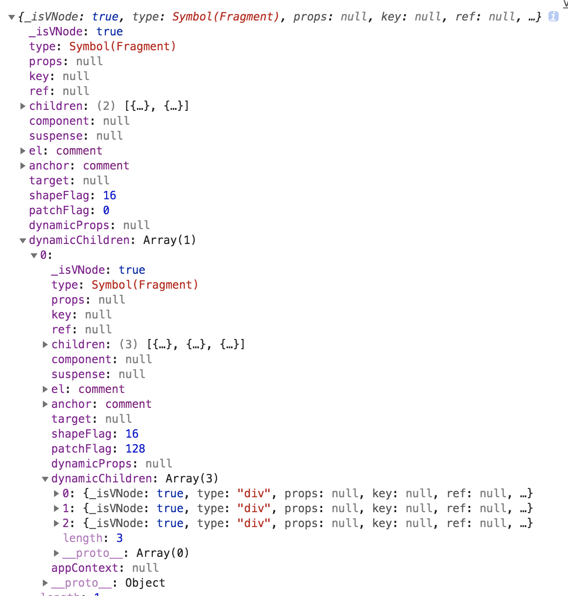

# 重要核心函数介绍

## createApp和render函数
最终打包入口vue/src/index文件导出了runtime-dom所有的方法，runtime-dom导出vue项目所有的方法，
该文件还设置了编译函数的实现逻辑通过registerRuntimeCompiler方法
``` js
// 文件runtime-dom/src/index下导出createApp方法
const { render, createApp } = createRenderer<Node, Element>({
  patchProp,  // 设置节点属性attr、prop等方法，绑定事件等
  ...nodeOps  // dom节点的操作方法传入如：createElement、querySelector等方法
})

const wrappedCreateApp = () => {
  const app = createApp()
  // 之后在dev环境才打入isNativeTag判断是否是原生标签的方法
  Object.defineProperty(app.config, 'isNativeTag', {
    value: (tag: string) => isHTMLTag(tag) || isSVGTag(tag),
    writable: false
  })
  return app
}

const exportedCreateApp = __DEV__ ? wrappedCreateApp : createApp

export { render, exportedCreateApp as createApp }
```

从上面可以知道createApp和render方法是通过运行runtime-core/src/createRenderer.ts文件中createRenderer方法返回出来，接下来我们来看看该方法
``` js
// 删除很多详细代码，大概代码如下
export function createRenderer<
  HostNode extends object = any,
  HostElement extends HostNode = any
>(
  options: RendererOptions<HostNode, HostElement>
): {
  render: RootRenderFunction<HostNode, HostElement>
  createApp: () => App<HostElement>
} {
  // 取到所有操作dom节点的方法
  const {
    querySelector: hostQuerySelector
  } = options
  // 所有装载方法的汇总，根据传入vonde节点的type类型决定使用什么方法装载
  function patch() {},
  // 卸载组件方法
  function unmount() {},
  // render函数专门用来渲染vnode节点到指定dom节点上
  function render(vnode: HostVNode | null, rawContainer: HostElement | string) {
    let container: any = rawContainer
    if (isString(container)) {
      container = hostQuerySelector(container)
      if (!container) {
        if (__DEV__) {
          warn(
            `Failed to locate root container: ` + `querySelector returned null.`
          )
        }
        return
      }
    }
    if (vnode == null) {
      if (container._vnode) {
        unmount(container._vnode, null, null, true)
      }
    } else {
      patch(container._vnode || null, vnode, container)
    }
    // 该方法存在于/runtime-core/src/scheduler.ts中,初始化之后触发队列回调函数，主要用在
    // watch某个属性时候的回调，后面会详细讲到
    flushPostFlushCbs()
    // 节点对象上使用_vnode属性标记该节点的vnode节点值
    container._vnode = vnode
  }

  return {
    render,
    createApp: createAppAPI(render)
  }
}
```
接下来看看runtime-core/src/apiApp.ts中的createAppAPI方法，运行此方法返回createApp函数
``` js
export function createAppContext(): AppContext {
  return {
    config: {
      devtools: true,
      performance: false,
      isNativeTag: NO, // 一个函数() => false
      isCustomElement: NO,
      errorHandler: undefined,
      warnHandler: undefined
    },
    mixins: [],
    components: {},
    directives: {},
    provides: {}
  }
}
export function createAppAPI<HostNode, HostElement>(
  render: RootRenderFunction<HostNode, HostElement>
): () => App<HostElement> {
  // Vue.createApp()运行此方法来创建app应用的时候实际上就是调用此方法，返回的是整个app对象
  // 你也可以在全局注入使用的东西如mixin等
  return function createApp(): App {
    // 创建初始化上下文
    const context = createAppContext()

    let isMounted = false

    const app: App = {
      get config() {
        return context.config
      },

      set config(v) {
        if (__DEV__) {
          warn(
            `app.config cannot be replaced. Modify individual options instead.`
          )
        }
      },
      // 给框架拓展插件如vue-router等
      use(plugin: Plugin) {
        if (isFunction(plugin)) {
          plugin(app)
        } else if (isFunction(plugin.install)) {
          plugin.install(app)
        } else if (__DEV__) {
          warn(
            `A plugin must either be a function or an object with an "install" ` +
              `function.`
          )
        }
        return app
      },
      // 全局打入混合
      mixin(mixin: ComponentOptions) {
        context.mixins.push(mixin)
        return app
      },
      // 全局写入组件，如果有该组件则返回该组件，没有则注册并且返回当前app实例
      component(name: string, component?: Component): any {
        if (__DEV__) {
          validateComponentName(name, context.config)
        }
        if (!component) {
          return context.components[name]
        } else {
          context.components[name] = component
          return app
        }
      },
      // 全局注册指令
      directive(name: string, directive?: Directive) {
        if (!directive) {
          return context.directives[name] as any
        } else {
          context.directives[name] = directive
          return app
        }
      },
      // 装载根组件并进行实例化
      mount(
        rootComponent: Component,
        rootContainer: string | HostElement,
        rootProps?: Data
      ): any {
        if (!isMounted) {
          // 创建vnode节点
          const vnode = createVNode(rootComponent, rootProps)
          // 在根VNode上存储应用程序上下文，初次装载时候会被设置到根实例上
          vnode.appContext = context
          render(vnode, rootContainer)
          isMounted = true
          return vnode.component!.renderProxy
        } else if (__DEV__) {
          warn(
            `App has already been mounted. Create a new app instance instead.`
          )
        }
      },
      // 全局依赖注入
      provide(key, value) {
        if (__DEV__ && key in context.provides) {
          warn(
            `App already provides property with key "${key}". ` +
              `It will be overwritten with the new value.`
          )
        }
        context.provides[key as string] = value
      }
    }
    return app
  }
}
```

## h函数
位于runtime-core/src/h.ts中，用来手动编写呈现函数，后面会介绍他如何使用，代码如下
``` js
export function h(
  type: VNodeTypes,
  propsOrChildren?: any,
  children?: any
): VNode {
  if (arguments.length === 2) {
    if (isObject(propsOrChildren) && !isArray(propsOrChildren)) {
      // 没有props只有孩子vnode节点
      if (isVNode(propsOrChildren)) {  // 如果是vnode节点
        return createVNode(type, null, [propsOrChildren])
      }
      // 没有孩子节点只有props
      return createVNode(type, propsOrChildren)
    } else {
      // 如果是其他类型则忽略props
      return createVNode(type, null, propsOrChildren)
    }
  } else {
    // 三个参数说明属性props和孩子节点都有
    if (isVNode(children)) {
      children = [children]
    }
    return createVNode(type, propsOrChildren, children)
  }
}
```

## createVNode函数
位于runtime-core/src/vnode.ts中
``` js
export function createVNode(
  type: VNodeTypes,
  props: { [key: string]: any } | null = null,
  children: unknown = null,
  patchFlag: number = 0,
  dynamicProps: string[] | null = null
): VNode {
  // class & style序列化
  if (props !== null) {
    // 对于reactive和proxy代理对象我们去除代理得到纯对象
    if (isReactive(props) || SetupProxySymbol in props) {
      props = extend({}, props)
    }
    if (props.class != null) {
      // 把class数组或者对象形式的变成一个字符串
      props.class = normalizeClass(props.class)
    }
    let { style } = props
    if (style != null) {
      if (isReactive(style) && !isArray(style)) {
        // 去掉对象的proxy代理
        style = extend({}, style)
      }
      // 格式化style属性变成对象形式
      props.style = normalizeStyle(style)
    }
  }
  // 标记传进来的组件需要生成的vnode类型
  const shapeFlag = isString(type)
    ? ShapeFlags.ELEMENT
    : isObject(type)
      ? ShapeFlags.STATEFUL_COMPONENT
      : isFunction(type)
        ? ShapeFlags.FUNCTIONAL_COMPONENT
        : 0
  const vnode: VNode = {
    _isVNode: true,  // 标示是否是vnode节点
    type,  // 保存整个传进来的组件参数
    props,
    key: (props && props.key) || null,
    ref: (props && props.ref) || null,
    children: null,
    component: null,
    suspense: null,
    el: null,
    anchor: null,
    target: null,
    shapeFlag,
    patchFlag,
    dynamicProps,
    dynamicChildren: null,  // 保存动态的子节点如v-if、v-for等渲染出来的
    appContext: null   // 保存整个app上下文如mixin、config等在mount方法触发时候赋值
  }

  normalizeChildren(vnode, children)

  if (
    shouldTrack &&
    (patchFlag ||
      shapeFlag & ShapeFlags.STATEFUL_COMPONENT ||
      shapeFlag & ShapeFlags.FUNCTIONAL_COMPONENT)
  ) {
    trackDynamicNode(vnode)
  }

  return vnode
}
```

## openBlock、createBlock函数
位于runtime-core/src/vnode.ts中该函数用于创建代码块时候使用，代码块其实就是动态节点块，例如使用
v-for、v-if、slot或者绑定事件等都需要触发此方法创建代码块，而且先触发openBlock来记录动态节点栈，之后
再触发createBlock来绑定动态节点
``` js
const blockStack: (VNode[] | null)[] = []
export function openBlock(disableTracking?: boolean) {
  blockStack.push(disableTracking ? null : [])
}
export function createBlock(
  type: VNodeTypes,
  props?: { [key: string]: any } | null,
  children?: any,
  patchFlag?: number,
  dynamicProps?: string[]
): VNode {
  // 避免代码块追踪他自己，因为在createVNode方法里面也有trackDynamicNode方法
  shouldTrack = false
  const vnode = createVNode(type, props, children, patchFlag, dynamicProps)
  shouldTrack = true
  const trackedNodes = blockStack.pop()
  // 取出最后一个数组值绑定到vnode节点的dynamicChildren,并删除该数据值
  vnode.dynamicChildren =
    trackedNodes && trackedNodes.length ? trackedNodes : EMPTY_ARR
  // 将这个vnode打入到上一层父vnode的动态节点上，也就是blockStack的数组最后一个值
  trackDynamicNode(vnode)
  return vnode
}
function trackDynamicNode(vnode: VNode) {
  const currentBlockDynamicNodes = blockStack[blockStack.length - 1]
  if (currentBlockDynamicNodes != null) {
    currentBlockDynamicNodes.push(vnode)
  }
}
```
上面只是一个代码解释，比较难以理解，接下来我们使用一个代码实例来介绍一下原理
``` js
// 假设template如下
template: `
  <div>test</div>
  <div v-for="value in fordata">
      {{value}}
  </div>
`
// 经过编译函数之后编译成的可执行函数如下
const _Vue = Vue
const _createVNode = Vue.createVNode
// 静态节点
const _hoisted_1 = _createVNode("div", null, "test")
return function render() {
  with (this) {
    const { createVNode: _createVNode, renderList: _renderList, openBlock: _openBlock, createBlock: _createBlock, Fragment: _Fragment, toString: _toString } = _Vue  
    return (_openBlock(), _createBlock(_Fragment, null, [
      _hoisted_1,
      (_openBlock(), _createBlock(_Fragment, null, _renderList(fordata, (value) => {
        return (_openBlock(), _createBlock("div", null, _toString(value), 1 /* TEXT */))
      }), 128 /* UNKEYED_FRAGMENT */))
    ]))
  }
}
```
- 由上面可知触发createBlock之前一定会触发openBlock来创建动态栈的保存到数组里面
- 先运行两次openBlock之后再触发循环此时blockStack就是[ [], [] ]
- 接下来执行循环生成for循环的动态节点，先运行openBlock，此时blockStack就是[ [], [], [] ]
- 接下来执行createBlock他会生成vnode节点之后删除数组最后一位取出并绑定vnode.dynamicChildren这里是空
- 这时候blockStack就是[ [], [] ]，运行trackDynamicNode方法保存此时的vnode到数组最后一位
- 这时候blockStack就是[ [], [ vnode1 ] ]
- 接下来再循环openBlock和createBlock，循环完后blockStack是[ [], [ vnode1, vnode2, vnode3 ] ]
- 退出循环执行上一层的createBlock，生成父vnode节点暂时记为parentVnode，之后赋值
parentVnode.dynamicChildren = [ vnode1, vnode2, vnode3 ]
- 这时候blockStack就是[ [] ]，运行trackDynamicNode方法保存此时的parentVnode到数组最后一位
- 这时候blockStack就是[ [ parentVnode ] ]
- 再执行上一层的createBlock，生成祖父vnode节点暂时记为grandpaVnode，之后赋值
grandpaVnode.dynamicChildren = [ parentVnode ]
- 这时候blockStack就是[ ]为空遍历完成

以上，便是这两个方法的渲染过程，打印结果如下：
