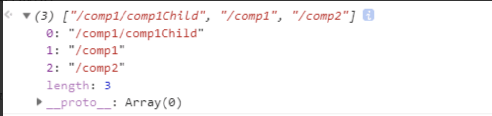

# vue-router源码解析

## 使用方法和注册vue-router插件
我们从 vue-router(3.0.2)的使用方法说起，当使用 vue-router 时，一般会分为3步
- 引入 vue-router，调用 Vue.use（Router）
- 实例化 router 对象，传入一个路由层级表 routes
- 在 main.js 中给根实例传入 router 对象

当我们调用 Vue.use（Router）时会执行插件的注册流程，可以看下对应的install方法
``` js
Vue.mixin({
  // 全局混入，在beforeCreate中会初始化当前路由的信息
  /** vue-router流程
   * 触发路由跳转 => init => transitionTo => 执行准备离开相关的路由钩子 => 接受到异步组
   * 件并解析 => 执行准备进入的路由的钩子
   * 确认导航成功  => 更新视图（触发完组件的所有声明周期） => 触发beforeRouterEnter的回调 **/
  beforeCreate () {
      //当是根实例时会进行路由初始化操作
    if (isDef(this.$options.router)) {
      this._routerRoot = this // 将routerRoot等于根实例
      this._router = this.$options.router // 给根实例添加_router属性等于router对象
      /**执行init方法初始化路由传入根实例**/
      this._router.init(this)
        /**将根实例的_router属性，即组件实例的$route属性定义为响应式，每次路由确认导航时
         * 会触发setter，将根实例重新渲染**/
        //每次路由切换都会执行回调修改_router(src/index.js:124)
      Vue.util.defineReactive(this, '_route', this._router.history.current)
    } else {
      // 非根实例则等于它父组件的_routerRoot(因为是树形结构所以所有的组件的_routerRoot都等于根实例)
      this._routerRoot = (this.$parent && this.$parent._routerRoot) || this
    }
    registerInstance(this, this)
  },
  destroyed () {
    registerInstance(this)
  }
})
 // 定义$router指向根实例的router对象
Object.defineProperty(Vue.prototype, '$router', {
  get () { return this._routerRoot._router }
})

  // 定义$router指向当前的路由
  // 指向根实例的 _route 属性，当 router-view 被生成时，会触发 $route 的 getter 函数
  // 同时会给 _route 收集到当前的渲染 watcher
Object.defineProperty(Vue.prototype, '$route', {
  get () { return this._routerRoot._route }
})

  // 全局注册RouterView,RouterLink
Vue.component('RouterView', View)
Vue.component('RouterLink', Link)
```

## 实例化vue-router创建路由映射表
通常使用 vue-router 时，会在 router.js 中通过 new Router 的形式生成一个 router 的实例，并传入一个
路由的层级表 routes 数组`new Router({routes:[]})`我们称这个数组的每个元素叫做一个路由配置项对象（源
码中的类型名叫 RouteConfig)，仔细观察可以发现它是一个树形的数据结构，即含有一个 children 数组，数组的
元素也是一个路由配置项对象
``` js
// 了解路由配置项对象后，我们找到源码中对应的 VueRouter 类
export default class VueRouter {
  constructor (options: RouterOptions = {}) {
    this.options = options
      /**创建核心的matcher对象*/
    this.matcher = createMatcher(options.routes || [], this)
    let mode = options.mode || 'hash'
    // 选择了history模式但是不支持会回退到hash路由
    this.fallback = mode === 'history' && !supportsPushState && options.fallback !== false
    // 降级为hash模式（显示声明为hash模式 | 不支持history模式 | 要求降级fallback:true）
    if (this.fallback) {
      mode = 'hash'
    }
    if (!inBrowser) {
      mode = 'abstract'
    }
    this.mode = mode

    // 根据mode来新建不同的实例（HTML5History | HashHistory | AbstractHistory）给history属性
    // 根据 history 的类型，采取不同的方式切换路由（108）
    switch (mode) {
      case 'history':
        this.history = new HTML5History(this, options.base)
        break
      case 'hash':
        this.history = new HashHistory(this, options.base, this.fallback)
        break
      case 'abstract':
        this.history = new AbstractHistory(this, options.base)
        break
      default:
        if (process.env.NODE_ENV !== 'production') {
          assert(false, `invalid mode: ${mode}`)
        }
    }
  }
```
先来看 matcher 属性，图中第四行会执行到 createMatcher 方法，返回一个 matcher 对象，包含 match 和 addRoutes
这2 个方法，这 2 个方法是 vue-router 中比较重要的方法，之后我们会分析它们的作用在这之前先看一下 createMatcher函
数执行时触发的 createRouteMap 函数
``` js
export function createMatcher (
  routes: Array<RouteConfig>, //routes为实例化vueRouter的路由列表
  router: VueRouter
): Matcher {
  // 而 createRouteMap 这个函数就是用来创建路由的映射表的，它是一个记录所有信息（路由记录）的对象，将参数
  // routes 数组（即上面提到的路由配置项数组）进行一系列处理，生成 pathList，pathMap，nameMap 3张路由映射表
  const { pathList, pathMap, nameMap } = createRouteMap(routes)
  // 这个 api 日常开发也遇到过，用于动态注册路由，它的原理其实很简单，就是接受一个 routes 数组，再次调用
  // createRouteMap 将数组每个元素转换成路由记录 (RouteRecord) ，然后合并到之前生成的路由映射表中
  function addRoutes (routes) {
    createRouteMap(routes, pathList, pathMap, nameMap)
  }
  // 调用router.match/router.matcher.match实质上是调用这个方法
  /**通过当前的路径结合之前生成的所有路由的record记录生成一个route对象并返回（createRoute方法）**/
  function match (
    raw: RawLocation, //值为location.pathname（第一次跳转）或者 location 对象
    currentRoute?: Route,
    redirectedFrom?: Location
  ): Route {
    // logic
  }

  return {
    match,
    addRoutes
  }
}
// 用来创建路由的映射表的，它是一个记录所有信息（路由记录）的对象，将参数 routes 数组（即上面提到的
// 路由配置项数组）进行一系列处理，生成 pathList，pathMap，nameMap 3张路由映射表
export function createRouteMap (
  routes: Array<RouteConfig>,
  oldPathList?: Array<string>,
  oldPathMap?: Dictionary<RouteRecord>,
  oldNameMap?: Dictionary<RouteRecord>
): {
  // 返回3个对象pathList,pathMap,nameMap
  pathList: Array<string>;
  pathMap: Dictionary<RouteRecord>;
  nameMap: Dictionary<RouteRecord>;
} {
  // 设置默认值
  // 当已经完整执行过createRouteMap，使用addRoutes动态添加路由时，pathMap，nameMap会有值，否则为空
  // the path list is used to control path matching priority
  const pathList: Array<string> = oldPathList || []
  // $flow-disable-line
  const pathMap: Dictionary<RouteRecord> = oldPathMap || Object.create(null)
  // $flow-disable-line
  const nameMap: Dictionary<RouteRecord> = oldNameMap || Object.create(null)

  routes.forEach(route => {
    // 遍历每项路由数组，执行addRouteRecord函数，将上面3个参数和当前的遍历项作为参数传入
    // 根据配置项routes生成3个路由信息(pathList, pathMap, nameMap)
    addRouteRecord(pathList, pathMap, nameMap, route)
  })
  return {
    pathList,
    pathMap,
    nameMap
  }
}
```
接下来我们重点分析下addRouteRecord方法，值得注意的是里面用到了路径解析的正则的插件，可以参考
[path-to-regexp](https://github.com/pillarjs/path-to-regexp)
``` js
// const regexp = pathToRegexp("/:foo/:bar");
// keys = [{ name: 'foo', prefix: '/', ... }, { name: 'bar', prefix: '/', ... }]
// regexp.exec("/test/route");
//=> [ '/test/route', 'test', 'route', index: 0, input: '/test/route', groups: undefined ]
function compileRouteRegex (path: string, pathToRegexpOptions: PathToRegexpOptions): RouteRegExp {
  const regex = Regexp(path, [], pathToRegexpOptions)
  if (process.env.NODE_ENV !== 'production') {
    const keys: any = Object.create(null)
    regex.keys.forEach(key => {
      warn(!keys[key.name], `Duplicate param keys in route with path: "${path}"`)
      keys[key.name] = true
    })
  }
  return regex
}
//addRouteRecord会遍历所有routes逐步给pathMap/nameMap添加路由的信息（record）
function addRouteRecord (
    //第一次调用前3个参数为空对象
  pathList: Array<string>,
  pathMap: Dictionary<RouteRecord>,
  nameMap: Dictionary<RouteRecord>,
  route: RouteConfig,  // 第一次调用时只有route有值，为当前遍历到的route对象
  parent?: RouteRecord,
  matchAs?: string //路由别名
) {
  // 获取路由的path属性和name属性
  const { path, name } = route
  const pathToRegexpOptions: PathToRegexpOptions = route.pathToRegexpOptions || {}
  // 规范化路由（如果当前route有父route，则返回一个父子的完整路径）
    // e.g "/parent/child"
  const normalizedPath = normalizePath(
    path,
    parent,
    pathToRegexpOptions.strict
  )
    // 用的不多
  if (typeof route.caseSensitive === 'boolean') {
    pathToRegexpOptions.sensitive = route.caseSensitive
  }

  // 定义当前route的路由记录
  const record: RouteRecord = {
    path: normalizedPath, // 规范化后的路由
    // 匹配到当前 route 对象的正则
    regex: compileRouteRegex(normalizedPath, pathToRegexpOptions),
    //route 对象的组件（因为 vue-router 中有命名视图，所以会默认放在 default 属性下，instances 同理）
    components: route.components || { default: route.component },
    // route 对象对应的 vm 实例
    instances: {},
    name,
    parent,
    matchAs,//路由别名
    redirect: route.redirect, //路由重定向
    beforeEnter: route.beforeEnter, //组件级别的路由钩子
    meta: route.meta || {}, //路由元信息
    props: route.props == null
      ? {}
      : route.components
        ? route.props
        : { default: route.props } //路由跳转时的传参
  }

  if (route.children) {
    // 递归遍历children数组执行addRouteRecord方法
    route.children.forEach(child => {
      const childMatchAs = matchAs
        ? cleanPath(`${matchAs}/${child.path}`)
        : undefined
        // 与第一次调用addRouteRecord不同的是，递归遍历children会额外传入record,childMatchAs参数
        // record是当前路由项，即子组件父路由的路由记录
      addRouteRecord(pathList, pathMap, nameMap, child, record, childMatchAs)
    })
  }
  // 用的不多
  if (route.alias !== undefined) {
    const aliases = Array.isArray(route.alias)
      ? route.alias
      : [route.alias]

    aliases.forEach(alias => {
      const aliasRoute = {
        path: alias,
        children: route.children
      }
      addRouteRecord(
        pathList,
        pathMap,
        nameMap,
        aliasRoute,
        parent,
        record.path || '/' // matchAs
      )
    })
  }
  // 递归遍历到最底部的route(叶子节点)
  // 构造pathMap和nameMap映射表
  // 第一次pathMap为空对象，后续使用addRoutes动态添加路由时会有已有的路由映射表）
  if (!pathMap[record.path]) {
    // pathList是一个数组，保存着routes列表中所有route的路径
    pathList.push(record.path)
    // pathMap是一个对象，保存着routes列表中所有route的记录（87）
    // 属性是route的路径，值是route的记录
    pathMap[record.path] = record
  }

    // 给nameMap同样添加record对象
    // pathMap和nameMap不同的是键名，一个由path路由路径作为键,一个由name路由名称作为键
  if (name) {
    if (!nameMap[name]) {
      nameMap[name] = record
    } else if (process.env.NODE_ENV !== 'production' && !matchAs) {
      warn(
        false,
        `Duplicate named routes definition: ` +
        `{ name: "${name}", path: "${record.path}" }`
      )
    }
  }
}
```
通过上面的分析可以知道最终会生成的路由记录是这样的

随后因为 routes 不仅是一个数组，也是一个树形结构，所以需要进行递归的遍历，然后将路由 对象放入这3个路由映射
表中，而这3个路由映射表的区别在于
- pathList：数组，保存了 route 对象的路径
- pathMap：对象，保存了所有 route 对象对应的 record 对象
- nameMap：对象，保存了所有含有name属性的 route 对象对应的 record 对象
可以看到pathMap和nameMap几乎是一样的，因为图中的路由有name属性，假设某个路由没name属性则只在pathMap中存在
pathList:

pathMap:

nameMap:


## createMatcher中match函数
createMatcher 返回的第二个函数是 match，match 函数用于创建 $route 对象, 注意$router是new VueRouter的
返回值，这里的$route是当前页面的路由对象,这里先用用图片看下区别
一个正常的路由配置参数中的其中一个路由大概配置如下

$route(经过 vue-router 处理后当前页面的路由对象)

每次路由跳转的时候都会执行这个 match 函数重新生成一个 $route 对象，具体什么时候会触发 match 放到下篇中讲，这章
先分析 match 函数是如何最终生成一个真正的 $route 对象的
``` js
function match (
  raw: RawLocation, //值为location.pathname（第一次跳转）或者 location 对象
  currentRoute?: Route,
  redirectedFrom?: Location
): Route {
  // 如果raw是 location.pathname 将它规范化为一个location对象（详情：test/unit/specs/location.spec.js:4）
  const location = normalizeLocation(raw, currentRoute, false, router)
  const { name } = location

  if (name) {  // 跳转路由信息中有name属性则去nameMap映射表找对应name的记录
    const record = nameMap[name]
    if (!record) return _createRoute(null, location)
    if (record) {
        /**创建route路由对象**/
      return _createRoute(record, location, redirectedFrom)
    }
  } else if (location.path) { //否则就去pathList和pathMap根据path找对应的路由信息
    location.params = {}
    for (let i = 0; i < pathList.length; i++) {
      const path = pathList[i]
      const record = pathMap[path]
      // 使用当前 location 的 path 属性和每个路由记录的正则属性进行匹配
      if (matchRoute(record.regex, location.path, location.params)) {
          /**结合 record 创建route路由对象**/
        return _createRoute(record, location, redirectedFrom)
      }
    }
  }
  // no match
    // 创建一个匹配失败的route对象（会在视图中创建一个注释节点）
  return _createRoute(null, location)
}
```
- vue-router 在 location 接口的基础上做了一些增强，添加了 name,path,hash 等 vue-router 特有的属性
- 举个例子，当调用 router.push({name:"comp1"}) 使用 name 的形式进行路由跳转时，返回的 loaction 对象
就会有一个 name 属性，当 name 存在时，会走到上图中的 true 逻辑，从之前 createMatcher 生成的 nameMap
路由映射表中找到对应 name 的路由记录对象，最终会执行 _createRoute 这个方法
- 调用 router.push("/comp1") 使用路径的形式进行路由跳转，同样也会返回一个 location 对象，但不会有name
属性，走上图的false逻辑，从pathMap和pathList中找到对应的路由记录对象，最终也会执行_createRoute 这个方法

我们来看下createRoute方法
``` js
// 创建$route对象
export function createRoute (
  record: ?RouteRecord,
  location: Location,
  redirectedFrom?: ?Location,
  router?: VueRouter
): Route {
  const stringifyQuery = router && router.options.stringifyQuery

  let query: any = location.query || {}
  // 深拷贝query对象
  try {
    query = clone(query)
  } catch (e) {}

  const route: Route = {
    name: location.name || (record && record.name),
    meta: (record && record.meta) || {},
    path: location.path || '/',
    hash: location.hash || '',
    query,
    params: location.params || {},
    fullPath: getFullPath(location, stringifyQuery),
    /**返回当前的路由记录以及所有的父路由的记录（父 => 子）**/
    // matched 是一个数组，每个元素都是一个路由记录
    matched: record ? formatMatch(record) : []
  }
  if (redirectedFrom) {
    route.redirectedFrom = getFullPath(redirectedFrom, stringifyQuery)
  }
  return Object.freeze(route)
}
// 根据当前路径匹配到的 record 和它的所有父级生成一个match数组
function formatMatch (record: ?RouteRecord): Array<RouteRecord> {
  const res = []
    // 递归遍历当前路由和所有父路由放入match数组中 [父=》子]
  while (record) {
    res.unshift(record)
    record = record.parent
  }
  return res
}
```
最终会生成如下这个 matched 数组最终会决定触发哪些路由组件的哪些路由守卫钩子，关于路由钩子部分我们放到下篇来说

这里画了一张流程图来表达实例化 vue-router 时的 matcher 属性内部的依赖关系


## 生成 history 路由实例
再次回到图3，vue-router 根据传入参数的 mode 属性来实例化不同的路由类（HTML5，hash，abstract），这
也是官方提供给开发者的3种不同的选择来生成路由，之后根据 history 的类型，采取不同的方式切换路由和监听路由变化的方式

- HTML5 路由是相对比较美观的一种路由，和正常的 url 显示没有什么区别，核心依靠 pushState 和 replaceState来
实现不向后端发送请求的路由跳转，但是这类似一层“伪装”，当用户点击刷新按钮时就会暴露，最后还是会发送请求，导致找不
到页面的情况，所以需要配合 nginx 来实现找不到页面时返回主页的操作

- hash路由是默认使用的路由，在url中会存在一个#号，核心依靠这个#号也就是曾经作为路由的锚点来实现不向后端发送请求的路由跳转

- abstract路由是一种抽象路由，用在非浏览器端，维护一种抽象的路由结构，使得能够嫁接在客户端或者服务端等没history路由的地方


