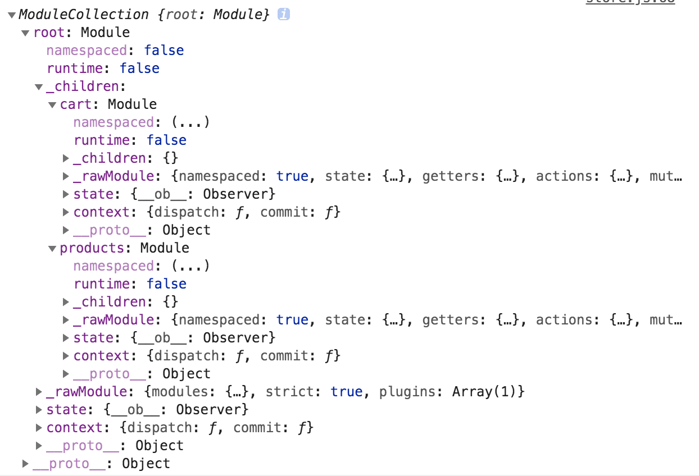

# vuex模块部分

## module-collection
我们可以先通过一个简单的例子来观察下，最终生成的store树是什么样子的
``` js
export default new Vuex.Store({
  modules: {
    cart: {
      namespaced: true,
      state: {},
      getters: {},
      actions: {},
      mutions:{},
    },
    products: {
      namespaced: true,
      state: {},
      getters: {},
      actions: {},
      mutions:{},
    }
  },
  strict: debug,
  plugins: debug ? [createLogger()] : []
})
```

有关module目录下的内容，该目录有两个文件分别是module-collection.js和module.js，这两个文件主要是有关于vuex中模块的内容；
首先我们看看module-collection.js,这个文件主要导出一个`ModuleCollection`类
``` js
constructor (rawRootModule) {
  // 主要是注册根模块，我们在之前store的构造函数中曾经使用到this._modules = new ModuleCollection(options)
  // 使用该方法注册一个根模块然后缓存在this._module中
  this.register([], rawRootModule, false)
}
get (path) {
  // 通过数组的循环来递归来找到子模块对象
  return path.reduce((module, key) => {
    return module.getChild(key)
  }, this.root)
}
//getNamespace函数，利用传入的参数path，生成相应的命名空间，实现的原理跟上述的get方法类似
getNamespace (path) {
  let module = this.root
  return path.reduce((namespace, key) => {
    module = module.getChild(key)
    return namespace + (module.namespaced ? key + '/' : '')
  }, '')
}
// 我们看下register函数
register (path, rawModule, runtime = true) {
  if (process.env.NODE_ENV !== 'production') {
    // 配置的验证，如验证getters、mutations等配置的格式时候正确
    assertRawModule(path, rawModule)
  }
  //创建一个新模块，具体会在后面讲到Module的时候分析
  const newModule = new Module(rawModule, runtime)
  if (path.length === 0) {
    this.root = newModule
  } else {
    //根据path路径，利用get方法获取父模块 
    const parent = this.get(path.slice(0, -1))
    //为其对应父模块添加子模块
    parent.addChild(path[path.length - 1], newModule)
  }
  // 注册嵌套模块,子module 添加其父module的_children属性上，最终形成一棵树
  if (rawModule.modules) {
    forEachValue(rawModule.modules, (rawChildModule, key) => {
      this.register(path.concat(key), rawChildModule, runtime)
    })
  }
}
//相反，unregister函数则是移除一个模块
unregister (path) {
    // 通过get方法获取父模块
    const parent = this.get(path.slice(0, -1))
    //获取需要删除的模块的名称，即他的key
    const key = path[path.length - 1]
    if (!parent.getChild(key).runtime) return
    //利用module中removeChild方法删除该模块，其实就是delete了对象上的一个key
    parent.removeChild(key)
}
//upate方法，就是更新模块从根模块开始递归更换，具体看下面update方法的实现
update (rawRootModule) {
  update([], this.root, rawRootModule)
}
```
接下来讲解一下function update的实现
``` js
function update (path, targetModule, newModule) {
  if (process.env.NODE_ENV !== 'production') {
    assertRawModule(path, newModule)
  }
  // 目标模块更新为新模块，具体实现是将原有模块的namespaced，actions，mutations，getters替换
  // 为新模块的namespaced，actions，mutations，getters
  // 具体会在Module类中update方法讲解
  targetModule.update(newModule)
 
  // 如果新的模块有子模块，则递归更新子模块
  if (newModule.modules) {
    for (const key in newModule.modules) {
      if (!targetModule.getChild(key)) {
        if (process.env.NODE_ENV !== 'production') {
          console.warn(
            `[vuex] trying to add a new module '${key}' on hot reloading, ` +
            'manual reload is needed'
          )
        }
        return
      }
      update(
        path.concat(key),
        targetModule.getChild(key),
        newModule.modules[key]
      )
    }
  }
}
```

## module
接下来就应该分析目录中的另一个文件module.js，这个文件主要导出一个Module类，这个类主要描述了vuex中模块的功能
``` js
//构造函数，主要做了一些模块初始化的事情
constructor (rawModule, runtime) {
  //缓存运行时的标志
  this.runtime = runtime
  //创建一个空对象来保存子模块
  this._children = Object.create(null)
  //缓存传入的模块
  this._rawModule = rawModule
  //缓存传入模块的state，如果state是一个函数，则执行这个函数
  const rawState = rawModule.state
  this.state = (typeof rawState === 'function' ? rawState() : rawState) || {}
}
//namespaced函数是主要就是获取当前模块是否是命名模块，vuex支持命名模块和匿名模块
get namespaced () {
    return !!this._rawModule.namespaced
}
//addChild,removeChild,getChild这三个函数就分别是添加，删除，获取子模块，内容比较简单，不赘述
// update方法，将原有缓存模块的namespaced，actions，mutations，getters替换成新传入模块的
update (rawModule) {
    this._rawModule.namespaced = rawModule.namespaced
    if (rawModule.actions) {
      this._rawModule.actions = rawModule.actions
    }
    if (rawModule.mutations) {
      this._rawModule.mutations = rawModule.mutations
    }
    if (rawModule.getters) {
      this._rawModule.getters = rawModule.getters
    }
}
//forEachChild函数，利用util中forEachValue方法，变量每个子模块，将每个子模块作为传入的回调函数参数，然后执行回调函数
//forEachGetter，forEachAction，forEachMutation代码逻辑跟上述forEachChild十分类似，不在赘述
forEachChild (fn) {
    forEachValue(this._children, fn)
}
```


