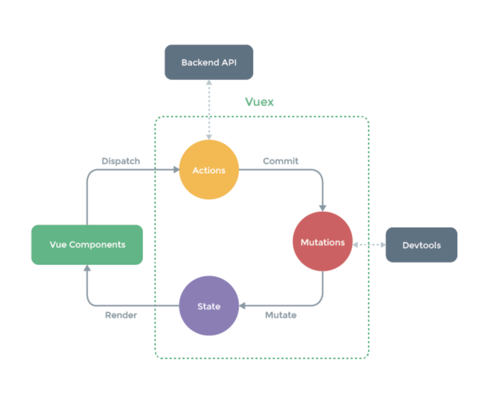

# vuex使用介绍

## 初步使用
在此我们分析的是3.1.2的版本，首先我们来看下项目目录的结构设计，以及遵循的规则
- 应用层级的状态应该集中到单个 store 对象中
- 提交 mutation 是更改状态的唯一方法，并且这个过程是同步的
- 异步逻辑都应该封装到 action 里面
- 如何组织代码随你便。如果store文件太大，只需将action、mutation 和 getter 分割到单独的文件



对于大型应用，我们会希望把 Vuex 相关代码分割到模块中。下面是项目结构示例：
``` js
├── index.html
├── main.js
├── api
│   └── ... # 抽取出API请求
├── components
│   ├── App.vue
│   └── ...
└── store
    ├── index.js          # 我们组装模块并导出 store 的地方
    ├── actions.js        # 根级别的 action
    ├── mutations.js      # 根级别的 mutation
    └── modules
        ├── cart.js       # 购物车模块
        └── products.js   # 产品模块
```


## State
Vuex通过store选项提供一种机制将状态从根组件“注入”到每一个子组件中需调用Vue.use(Vuex)
``` js
import Vue from 'vue'
import Vuex from 'vuex'
Vue.use(Vuex)
const store = new Vuex.Store({
  state: {
    count: 34,
  },
})
const app = new Vue({
  el: '#app',
  // 把 store 对象提供给 “store” 选项，这可以把 store 的实例注入所有的子组件
  store,
  components: { Counter },
  template: `
    <div class="app">
      <counter></counter>
    </div>
  `
})
// 通过在根实例中注册 store 选项，该 store 实例会注入到根组件下的所有子组件中，且子组件能通过 this.$store 访问
const Counter = {
  template: `<div>{{ count }}</div>`,
  computed: {
    count () {
      return this.$store.state.count
    }
  }
}
```
当一个组件需要获取多个状态时候，将这些状态都声明为计算属性会有些重复和冗余。为了解决这个问题，我们
可以使用 mapState 辅助函数帮助我们生成计算属性
``` js
// 在单独构建的版本中辅助函数为 Vuex.mapState
import { mapState } from 'vuex'
export default {
  // ...
  computed: mapState({
    // 箭头函数可使代码更简练
    count: state => state.count,

    // 传字符串参数 'count' 等同于 `state => state.count`
    // 这里其实是使用上面的count
    countAlias: 'count',

    // 为了能够使用 `this` 获取局部状态，必须使用常规函数
    // 这里之所以有state参数是因为当你使用mapState的时候该方法会将当前模块的store值作为参数传入
    countPlusLocalState (state) {
      return state.count + this.localCount
    }
  })
  //当映射的计算属性的名称与 state 的子节点名称相同时，我们也可以给 mapState 传一个字符串数组
  computed: mapState([
    // 映射 this.count 为 store.state.count
    'count'
  ])  
  //也可以使用对象展开运算符
  computed: {
    localComputed () { /* ... */ },
      // 使用对象展开运算符将此对象混入到外部对象中
      ...mapState({
        // ...
      })
    }
  }
```

## Getters
有时候我们需要从 store 中的 state 中派生出一些状态，例如对列表进行过滤并计数
``` js
//如果有多个组件需要用到此属性，我们要么复制这个函数，或者抽取到一个共享函数然后在多处导入它
computed: {
  doneTodosCount () {
    return this.$store.state.todos.filter(todo => todo.done).length
  }
}
```
Vuex 允许我们在 store 中定义“getter”（可以认为是 store 的计算属性）。就像计算属性一样，getter 的返回值会根据它的
依赖被缓存起来，且只有当它的依赖值发生了改变才会被重新计算Getter接受state作为其第一个参数,接受其他getter作为第二个参数
``` js
const store = new Vuex.Store({
  state: {
    todos: [
      { id: 1, text: '...', done: true },
      { id: 2, text: '...', done: false }
    ]
  },
  getters: {
    doneTodos: state => {
      return state.todos.filter(todo => todo.done)
    },
    doneTodosCount: (state, getters) => {
      return getters.doneTodos.length
    }
  }
})
// 使用方式同state
computed: {
  doneTodosCount () {
    return this.$store.getters.doneTodosCount
  }
}
// 同样也有相应的方法mapGetters
import { mapGetters } from 'vuex'
export default {
  // ...
  computed: {
  // 使用对象展开运算符将 getter 混入 computed 对象中
    ...mapGetters([
      'doneTodosCount',
      'anotherGetter',
      // ...
    ])
  }
  computed: mapGetters({
    // 把 `this.doneCount` 映射为 `this.$store.getters.doneTodosCount`
    doneCount: 'doneTodosCount'
  })
}
```

## Mutations
更改 Vuex 的 store 中的状态的唯一方法是提交 mutation。Vuex 中的 mutation 非常类似于事件：每个mutation都有一个字
符串的事件类型 (type) 和 一个回调函数 (handler)。这就是我们实际进行状态更改的地方，且它会接受state作为第一个参数,之
后也可以传递任意位数参数
``` js
const store = new Vuex.Store({
  state: {
    count: 1
  },
  mutations: {
    increment (state, payload) {
      // 变更状态
      state.count += payload.amount
    }
  }
})
// 可以通过以下方法提交commmit
this.$store.commit('increment', {
  amount: 10
})
this.$store.commit({
  type: 'increment',
  amount: 10
})
```
Vuex 的 store 中的状态是响应式的，那么当我们变更状态时，监视状态的 Vue 组件也会自动更新。这也意味着Vuex中的
mutation 也需要与使用 Vue 一样遵守一些注意事项：
- 最好提前在你的 store 中初始化好所有所需属性
- 当需要在对象上添加新属性时，你应该使用`Vue.set(obj, 'newProp', 123)`或者以新对象替换老对象。例如，利用
对象展开运算符`state.obj = { ...state.obj, newProp: 123 }`

使用常量替代 mutation 事件类型在各种 Flux 实现中是很常见的模式。这样可以使 linter 之类的工具发挥作用，同时
把这些常量放在单独的文件中可以让你的代码合作者对整个 app 包含的 mutation 一目了然
``` js
// mutation-types.js
export const SOME_MUTATION = 'SOME_MUTATION'
// store.js
import Vuex from 'vuex'
import { SOME_MUTATION } from './mutation-types'
const store = new Vuex.Store({
  state: { ... },
  mutations: {
    // 我们可以使用 ES2015 风格的计算属性命名功能来使用一个常量作为函数名
    [SOME_MUTATION] (state) {
      // mutate state
    }
  }
})
```
你可以在组件中使用 this.$store.commit('xxx') 提交 mutation，或者使用 mapMutations 辅助函数将组件中
的methods 映射为 store.commit 调用（需要在根节点注入 store）
``` js
import { mapMutations } from 'vuex'
export default {
  // ...
  methods: {
    ...mapMutations([
      'increment', // 将 `this.increment()` 映射为 `this.$store.commit('increment')`

      // `mapMutations` 也支持载荷：
      'incrementBy' // 将 `this.incrementBy(amount)` 映射为 `this.$store.commit('incrementBy', amount)`
    ]),
    ...mapMutations({
      add: 'increment' // 将 `this.add()` 映射为 `this.$store.commit('increment')`
    })
  }
}
```

## Actions
Action 函数接受一个与 store 实例具有相同方法和属性的 context 对象，因此你可以调用 context.commit 提交一
个mutation，或者通过 context.state 和 context.getters 来获取 state 和 getters。当我们在之后介绍到Modules
时，你就知道 context 对象为什么不是 store 实例本身了
``` js
// 假设 getData() 和 getOtherData() 返回的是 Promise
actions: {
  async actionA ({ commit }) {
    commit('gotData', await getData())
  },
  async actionB ({ dispatch, commit }) {
    await dispatch('actionA') // 等待 actionA 完成
    commit('gotOtherData', await getOtherData())
}
//来看一个更加实际的购物车示例，涉及到调用异步 API 和分发多重 mutation
actions: {
  checkout ({ commit, state }, products) {
    // 把当前购物车的物品备份起来
    const savedCartItems = [...state.cart.added]
    // 发出结账请求，然后乐观地清空购物车
    commit(types.CHECKOUT_REQUEST)
    // 购物 API 接受一个成功回调和一个失败回调
    shop.buyProducts(
      products,
      // 成功操作
      () => commit(types.CHECKOUT_SUCCESS),
      // 失败操作
      () => commit(types.CHECKOUT_FAILURE, savedCartItems)
    )
  }
}
// 以载荷形式分发
store.dispatch('checkout', {
  amount: 10
})

// 以对象形式分发
store.dispatch({
  type: 'checkout',
  amount: 10
})
```
你在组件中使用`this.$store.dispatch('xxx')`分发 action，或者使用 mapActions 辅助函数将组件的methods映
射为 store.dispatch 调用（需要先在根节点注入 store）
``` js
import { mapActions } from 'vuex'
export default {
  // ...
  methods: {
    ...mapActions([
      'increment', // 将 `this.increment()` 映射为 `this.$store.dispatch('increment')`

      // `mapActions` 也支持载荷：
      'incrementBy' // 将 `this.incrementBy(amount)` 映射为 `this.$store.dispatch('incrementBy', amount)`
    ]),
    ...mapActions({
      add: 'increment' // 将 `this.add()` 映射为 `this.$store.dispatch('increment')`
    })
  }
}
```

## Modules
由于使用单一状态树，应用的所有状态会集中到一个比较大的对象。当应用变得非常复杂时，store 对象就有可能变得相当臃肿
为了解决以上问题，Vuex 允许我们将 store 分割成模块（module）。每个模块拥有自己的 state、mutation、action、
getter、甚至是嵌套子模块——从上至下进行同样方式的分割
``` js
const moduleA = {
  state: { 
    userName:'limingkang',
   },
  mutations: { 
    increment (state) {
      // 这里的 `state` 对象是模块的局部状态
      state.count++
    }
  },
  actions: {//对于模块内部的 action，局部状态通过 context.state 暴露出来，根节点状态则为 context.rootState：
    incrementIfOddOnRootSum ({ state, commit, rootState }) {
      if ((state.count + rootState.count) % 2 === 1) {
        commit('increment')
      }
    }
  },
  getters: { //对于模块内部的 getter，根节点状态会作为第三个参数暴露出来
    sumWithRootCount (state, getters, rootState) {
      return state.count + rootState.count
    }
  }
}
const store = new Vuex.Store({
  modules: {
    a: moduleA,
    b: moduleB
  },
  state:{
    userName:'rootname',
  },
  getters: {
    sumWithRootCount (state, getters) {
      return state.userName;
    }
  }
})
store.state.a.userName // -> moduleA 的状态
store.state.b.userName // -> moduleB 的状态
```
启用了命名空间的 getter 和 action 会收到局部化的 getter，dispatch 和 commit。换言之，你在使用模块内
容（module assets）时不需要在同一模块内额外添加空间名前缀。更改 namespaced 属性后不需要修改模块内的代码
``` js
actions: {
  someOtherAction ({dispatch}) {
    dispatch('someRootAction')
  }
},
modules: {
  foo: {
    namespaced: true,

    getters: {
      // 在这个模块的 getter 中，`getters` 被局部化了
      // 你可以使用 getter 的第四个参数来调用 `rootGetters`
      someGetter (state, getters, rootState, rootGetters) {
        getters.someOtherGetter // -> 'foo/someOtherGetter'
        rootGetters.someOtherGetter // -> 'someOtherGetter'
      },
      someOtherGetter: state => { ... }
    },

    actions: {
      // 在这个模块中， dispatch 和 commit 也被局部化了
      // 他们可以接受 `root` 属性以访问根 dispatch 或 commit
      someAction ({ dispatch, commit, getters, rootGetters }) {
        getters.someGetter // -> 'foo/someGetter'
        rootGetters.someGetter // -> 'someGetter'

        dispatch('someOtherAction') // -> 'foo/someOtherAction'
        dispatch('someOtherAction', null, { root: true }) // -> 'someOtherAction'

        commit('someMutation') // -> 'foo/someMutation'
        commit('someMutation', null, { root: true }) // -> 'someMutation'
      },
      someOtherAction (ctx, payload) { ... },
      // 若需要在带命名空间的模块注册全局 action，你可添加 root: true，并将这个 action 的定义放在函数handler中
      someRootAction: {
        root: true,
        handler (namespacedContext, payload) { ... } // -> 'someAction'
      }
    }
  }
}
```
带命名空间的绑定函数
``` js
computed: {
  ...mapState({
    useName: state => state.a.useName
  })
  // 或者加入前缀
  ...mapState('a', {
    useName: state => state.useName,
  })
  // mapGeter 直接获得全局注册的getters
  ...mapGetters(["sumWithRootCount"])
  // mapGeter获取子sumWithRootCount
  ...mapGetters("a", ["sumWithRootCount"])
},
methods: {
  test() {
   this.$store.dispatch("a/incrementIfOddOnRootSum", "Jason")
  },
  // 加入命名空间前缀
  ...mapActions('a', ['incrementIfOddOnRootSum'])
}

// 可使用createNamespacedHelpers创建基于某个命名空间辅助函数。它返回一个对象，对象里有新的绑定在给定命名空间值上的组件绑定辅助函数
import { createNamespacedHelpers } from 'vuex'
const { mapState, mapActions } = createNamespacedHelpers('a')
export default {
  computed: {
    // 在 `some/nested/module` 中查找
    ...mapState({
      useName: state => state.useName,
    })
  },
  methods: {
    // 在a模块中查找
    ...mapActions([
      'incrementIfOddOnRootSum',
    ])
  }
}
```
在 store 创建之后，你可以使用 store.registerModule 方法动态注册该模块
``` js
// 注册模块 `myModule`
store.registerModule('myModule', {
  // ...
})
// 注册嵌套模块 `nested/myModule`
store.registerModule(['nested', 'myModule'], {
  // ...
})
// 保留state
store.registerModule('myModule', {
  // ...
}, { preserveState: true })
```
- 之后就可以通过`store.state.myModule`和`store.state.nested.myModule`访问模块的状态
- 你也可以使用 store.unregisterModule(moduleName) 来动态卸载模块但不能使用此方法卸载静态模块（即创建 store 时声明的模块）

在注册一个新 module 时，你很有可能想保留过去的state，例如从一个服务端渲染的应用保留 state。可通过preserveState选项将
其归档`store.registerModule('a', module, { preserveState: true })`当你设置`preserveState: true`时，该
模块会被注册，action、mutation 和 getter 会被添加到 store 中，但是 state 不会。这里假设 store 的 state 已经包含
了这个 module 的 state 并且你不希望将其覆写


